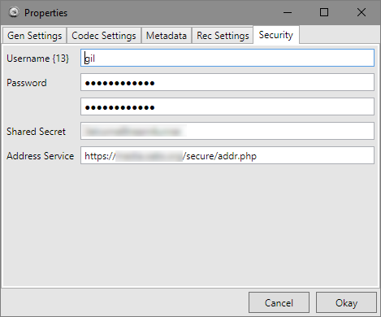
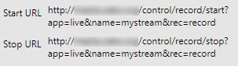

# Hammurabi II

**Hammurabi II** is a GUI wrapper for FFmpeg to simplify live streaming.
We defined the wrapper primarily to work with NginX with its rtmp module
installed, but it should work with any streaming service supported by FFmpeg.

## Operation


Once everything is set up, initiating a live stream is as easy as starting **Hammurabi II**,
selecting video and audio sources, specifying application and stream names, and clicking on the
_Start Broadcasting_ button. If the server (specified previously in the program's properties)
accepts the streaming request the broadcast will start, and by default, a video window will
open showing the raw video of the input stream.


If the live application has been configured to allow manual recording of the stream, the
user can start the recording by clicking on the _Start Recording_ button. Also, if the
live application allows viewing using the same application and stream name, the user can play
live stream from the server by clicking _Start Monitor_.

From the user's perspective each of the three start buttons turn into stop buttons to allow

## Stream Stats

During a broadcast live statistics from FFmpeg are displayed on the _Stats_ page.


## Program Properties

To set up the program for use is a little more technical and may require
help from someone familiar with FFmpeg, but it has been designed to be
as easy as possible for non-technical users. The _Properties_ window is
opended from the _File_ menu.


Several required fields must be specified before **Hammurabi II** is able to
initiate a broadcast. On the _Gen Settings_ page the user must specify paths
to ffmpeg.exe and ffplay.exe. (The path to ffprobe.exe is not currently used
within the program, but may be in future versions.) He must also specify the
fully qualified domain name of the streaming host, or its ip address. A default
_FFmpeg Arg Format_ may be modified to fit the needs of the user, but will work
as is without modification.


**Hammurabi II** directly supports H.264 video streams on the _Codec Settings_ page.
The default settings create a H.264 video stream with a constant bit rate of 96k and
an aac audio stream of 24k. To modify these settings changes can be made on this page,
and within the _FFmpeg Arg Format_ field on the _Gen Settings_ page.


Metadata may be supplied on the _Metadata_ page. The _FFmpeg Arg Format_ field on the
_Gen Settings_ page only references the _Artist_ and _Copyright_ fields by default, but
other metadata items can be added to the argument format if desired.


On the _Rec Settings_ page two fields are required to help specify
the path to use for starting and stopping recordings on the server.
**Hammurabi II** uses these fields and values specified elsewhere
within the program to create the start and stop URLs used for these
purposes. Obviously these fields must match the server's configuration.



Finally the _Security_ page is used to specify settings intended to
secure the server's streaming application from unauthoirzed use.
**Hammurabi II** uses these settings to generate a hash that can
be sent to the server to identify authorized users. The hash
incorporates the user's public IP address in addition to the user's
password and the shared secret in order to prevent others from
stealing the hash to impersonate the user.

Because the user may not know his public IP address he must supply
the address of an _Address Service_ that can make that determination.
This service may run on the media server, but it may be supplied
elsewhere. The service should return only the address of the user,
and nothing else.

For example this is right:

`72.22.145.16`

This is wrong:

```
<!DOCTYPE html>
<html>
    <body>
        72.22.145.16
    </body>
</html>
```

The following PHP script will provide the current IP address of the
caller in the correct format.

```
<?php
        echo $_SERVER['REMOTE_ADDR'];
?>
```

## Nginx Server Configuration

For proper operation the server must be setup to allow ffmpeg streaming, and
for all of Hammurabi II's to work, the server must be configured appropriately.
This document can't describe how that should be done on every server, some
examples can be given for Nginx servers that have been deployed with the rtmp
module.

To start Nginx must have an rtmp section defined either in nginx.conf directly
or included with the include directive. Within the rtmp container there must be
a server container, and within the server container a streaming application
must be defined similar to the following:

```
application live {
    live on;
    meta copy;
    on_publish http://localhost/auth.php;
    recorder record {
        record all manual;
        record_suffix -%Y-%m-%d.flv;
        record_append on;
        record_path /usr/local/nginx/html/video/staging;
     }
}
```

This defines an application called "live." Within the brackets several attributes
are specified to define the caracteristics of the application as follows.

1. "live on" specifies this as a live broadcast stream.
2. "meta copy" tells the application to copy the metadata from the input stream to the output stream.
3. "on_publish http://localhost/auth.php" specifies that the application should check with auth.php to authenticate publishers before broadcasting their streams. The application copies the arguments it receives from the publisher and adds several other arguments such as the publisher's ip address, the application name, and the stream name which may be used by auth.php to determine whether to authenticate the publisher.
4. "recorder record" creates a recorder called "record" to record the broadcast stream. Within the brackets following the direct several attributes are specified to define the recorder as follows.
   1. "record all manual" makes this a manual recorder meaning that recording starts and stops on command. This is accomplished through http GET requests using specific URLs. (See more below.)
   2. "record_suffix -%Y-%m-%d.flv;" specifies a suffic to be added to the filename of the recording. The start of the fill will be given the name of the stream. The placeholders, %Y, %m, and %d will be replaced with the four digit year, two digit month and two digit day that the file is recorded.
   3. "record_append on" tells the recorder to append new data to the end of existing files, if there is a file of the same name already exists rather than to create a new file. Given the suffix provided this recorder will create only one file per stream per day. Other suffixes would produce different results.
   4. "record_path /usr/local/nginx/html/video/staging" specifies where the recording should be saved.

The only required recorder settings are "record all manual" and "record_path" directives.
The others are optional and are used only if appropriate for your circumstances. The reader
shoiuld consult the [Directives](https://github.com/arut/nginx-rtmp-module/wiki/Directives)
documentation for the Nginx rtmp module for more information about these directives.

In addition to the above settings in the rtmp container one addition settings needs to
be added to one of the http server containers to enable recording. It should look like
this:

```
# rtmp control
location /control {
    rtmp_control all;
}
```

This directive tells the server to watch for GET requests that start with "/control"
and pass them to the rtmp module's control logic. With that in place the user can start
stop recording of his stream by sending GET requests with the following format:

`http://[server name or address]//control/record/[start|stop]?app=[app name]&name=[stream name]&rec=[recorder name]`

The reader may notice that this format is followed for the "Start URL" and "Stop URL" shown
on the "Rec Settings" page in the "Properties" window.



## Security

In order to prevent unauthorized users from starting broadcast streams **Hammurabi II**
supports the "On_Publish" directive. By default the "FFmpeg Arg Format" includes three
parameters on the publishing URL for security purposes. These are "u" for the username
of the publisher, "e" for an expiration time given as a Unix integer, and "h" for a
hash of the user's passwod, a shared secret, and other parameters. **Hammurabi II**
creates the expiration parameter and hash automatically. For Nginx to use this data
the file that is executed by the "on_publish" event needs to be installed in the
proper location for the call.

The following file can be used to authenticate the **Hammurabi II** user.

```
<?php

//check if querystrings exist or not
if(empty($_GET['u']) || empty($_GET['e']) || empty($_GET['h']) ||
    empty($_GET['addr']) || empty($_GET['app']) || empty($_GET['name']))
{
    //no querystrings or wrong syntax
    echo "Unauthorized! 50101";
    header('HTTP/1.0 404 Not Found');
    exit(1);
}
else
{
    //querystring exists
    $username = $_GET['u'];
    $expires = $_GET['e'];
    $userhash = $_GET['h'];

    $app = $_GET['app'];
    $name = $_GET['name'];
    $addr = $_GET['addr'];
}

// Specify the shared secret key
$secret = "MySharedSecretKey";

// *****************************************
// Specify authorized users
$passwords = [
    ["ted",        "password1"],
    ["tod",        "password2"],
    ["tim",        "password3"]
];

$pass = "";
$count = count($passwords);

for($i = 0; $i < $count; $i++)
{
    if($passwords[$i][0] == $username)
    {
        $pass = $passwords[$i][1];
    }
}

// *****************************************

if ($pass == "")
{
    echo "Unauthorized!";
    header('HTTP/1.0 404 Not Found');
    exit(1);
}

// Check the md5 hash
$myhash = md5("$username$expires$app$addr$name$secret$pass");

if (strtolower($userhash) != strtolower($myhash))
{
    echo "Unauthorized!";
    header('HTTP/1.0 404 Not Found');
    exit(1);
}

// Check if hash is expired
if (time() > $expires)
{
    echo "Unauthorized!";
    header('HTTP/1.0 404 Not Found');
    exit(1);
}

echo "Greetings! ";
?>
```

This script takes data supplied by the user and the server to create a new hash. The
hash is based on the following known values:

1. The username of the user.
2. The expiration time supplied by the user.
3. The application to which the user is requesting access.
4. The public IP address of the user.
5. The name of the stream the user has requested.
6. A shared secret known to the user and the server.
7. The user's password.

**Hammurabi II** creates its hash based on the same values.

If the hash created by the server matches the hash supplied by the user, the
user is authorized, and the stream will be published.

If an unauthorized user were to still the hash by some means, there are several
things that would prevent its successful use.

1. The hash would not work with any other username or expiration time.
2. The expiration time is set to one hour in the future. The hash would be invalid automatiaclly after that time.
3. The hash will work only with the given stream name and application name.
4. The hash will word only for users that have the specified public IP address.

## Wish List

1. Security for the recording URLs to prevent malicious start and stop requests.
2. Include monitor videos within the UI rather than separate windows.